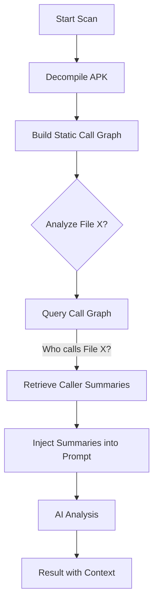

# Cross-Reference Context (Call Graph Analysis)

**Cross-Reference Context** is the "Context-Aware Engine" of Droid LLM Hunter. It distinguishes this tool from simple LLM wrappers by providing the AI with deep, structural awareness of the application's code flow.

Most AI scanners analyze files in isolation ("Stateless"). Droid LLM Hunter analyzes files in **Context**.

---

## 🧠 The Problem: Isolated Analysis

When an AI analyzes a single file without context, it often generates **False Positives**.

**Example Scenario:**
You have a file `DatabaseHelper.java`:
```java
public void deleteUser(String userId) {
    db.execSQL("DELETE FROM users WHERE id = " + userId); // Looks like SQL Injection!
}
```

*   **Stateless Scanner:** "CRITICAL RISK! SQL Injection detected in `deleteUser`."
*   **Reality:** This function might be called by a parent activity that *already sanitizes* the input or checks for Admin privileges. The scanner doesn't know that.

---

## 💡 The Solution: Context Injection

Droid LLM Hunter builds a **Call Graph** of the entire application before scanning. It understands "Who calls Who".

When analyzing `DatabaseHelper.java`, the engine injects knowledge about its callers into the prompt.

**The Prompt sent to AI becomes:**

> **System:** Analyze `DatabaseHelper.java`.
>
> **CONTEXT INJECTION:**
> *   `deleteUser()` is called by `AdminPanelActivity.java`.
> *   In `AdminPanelActivity.java`, the input `userId` is validated using `InputValidator.sanitize()`.
> *   `AdminPanelActivity.java` also checks `if (user.isAdmin)`.
>
> **Code:**
> ```java
> public void deleteUser(String userId) { ... }
> ```

**Result:**
*   **AI Decision:** "This function executes raw SQL, BUT the input is sanitized by the caller (`AdminPanelActivity`). **Status: SAFE (or Low Risk).**"

---

## 🛠️ How It Works (Technical Flow)

The `use_cross_reference_context` feature enables this pipeline:



1.  **Build Graph:** The engine scans all Smali/Java files to map method invocations.
2.  **Trace Dependencies:** For every file being analyzed, the engine identifies **Incoming Calls** (who calls me) and **Outgoing Calls** (who do I call).
3.  **Inject Summary:** The engine retrieves the *AI Summary* of those related files and appends them to the prompt as "External Context".

---

## 📊 Visual Example

### Without Context (Blind)
| File | AI Analysis | Result |
| :--- | :--- | :--- |
| `File_A.java` | "I see a dangerous function." | ❌ **High Risk** |

### With Cross-Reference Context (Aware)
| File | Context | AI Analysis | Result |
| :--- | :--- | :--- | :--- |
| `File_A.java` | "Caller `File_B` checks permissions." | "Dangerous function is guarded by Caller." | ✅ **Safe / False Positive** |

---

## ✅ Benefits

1.  **Drastic Reduction in False Positives:** AI understands when dangerous logic is actually protected by code elsewhere.
2.  **Better Explanations:** The AI can explain *why* something is safe (e.g., "Safe because input is sanitized in `MainActivity`").
3.  **Smarter Auditing:** Mimics a human auditor's workflow of jumping between files to understand flow.

---

## 🚧 Known Limitations

Cross-Reference Context is a powerful heuristic, but it is not perfect:

- Dynamic dispatch, reflection, and JNI calls may not be fully captured in the static call graph.
- Sanitization logic may be incomplete or conditional (e.g., only applied in some code paths).
- Obfuscated applications may reduce call graph accuracy.

For these reasons, DLH classifies findings as:
- SAFE
- LOW CONFIDENCE
- NEEDS MANUAL REVIEW

---

## ⚠️ Performance Note

Enabling `use_cross_reference_context: true` in `settings.yaml` will:
*   Increase initialization time (to build the graph).
*   Slightly increase token usage (because prompts are longer with injected context).
*   **Recommended:** Enable for final/deep audits. Disable for quick superficial scans.
